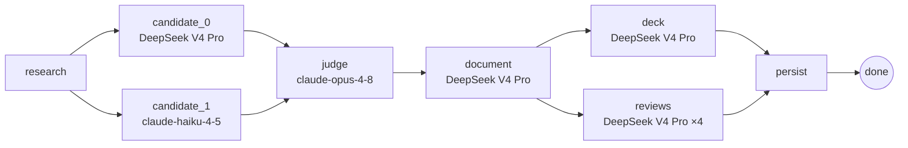

# APoc — Architecture POC Workspace

APoc compresses the slow part of early architecture work — generating a first POC,
getting every stakeholder (compliance, security, FinOps, CTO, architect) to review it,
and reaching alignment — into one auditable workspace instead of many alignment meetings.

A user describes a requirement in plain text — or uploads a requirements PDF that an LLM
distils into the same structured brief. APoc grounds its research in real crawled pages,
fans out to multiple LLM candidates, judges them into a single canonical design, writes a
seven-section document and a stakeholder review board in parallel, and delivers an
editable single-file HTML deck — all in one pipeline run. The review committee then
annotates, comments, and approves in a GitHub-style UI.

> **Product boundary:** APoc produces architecture artifacts — design, review, decisions,
> risks, visuals — not implementation code, IaC, or deploy configs.

---

## Table of contents

1. [What it does](#what-it-does)
2. [Architecture](#architecture)
3. [Design decisions](#design-decisions)
4. [What this demonstrates](#what-this-demonstrates)
5. [Quick start](#quick-start)
6. [Configuration](#configuration)
7. [Project layout](#project-layout)
8. [Testing](#testing)
9. [Evaluation](#evaluation)

---

## What it does

| Feature | Detail |
|---|---|
| **POC generation** | Research → multi-candidate design → judge → document + deck, all in one pipeline run |
| **Plain-text or PDF intake** | Describe the requirement in a chat-style intake, or upload a requirements PDF; an LLM extracts the same 8-key scoping brief the pipeline consumes (text PDFs, no OCR) |
| **Self-hosted grounding** | SearXNG discovers URLs, Crawl4AI fetches rendered bodies, the LLM writes a `[s1]`-cited digest |
| **Editable HTML deck** | The slide deck is a self-contained, architect-editable HTML file with deterministic, click-to-zoom architecture diagrams |
| **Cancellable pipeline** | A running generation can be cancelled mid-flight; nodes check a cancellation registry at phase boundaries and exit cleanly |
| **Stakeholder reviews** | Compliance, security, FinOps, and CTO lenses run in parallel; each produces a report and line-anchored annotations |
| **GitHub-style review UI** | Three-column layout: POC document (left), AI annotations (middle), review comments (right) |
| **Architect-only edit gate** | Only the architect role can modify the deck; every other stakeholder is read-only |
| **AI edit + chat** | Architect submits accepted comments; the AI performs a holistic rewrite addressing all of them in one pass and returns a diff-previewable proposal |
| **Approval roll-up** | architect, compliance, security, FinOps, and CTO each approve independently; the project is marked *ready to align* when all five have approved |
| **Audit trail** | Every pipeline step, comment, and approval is recorded to SQLite and exposed in a Trace tab |

---

## Architecture

### Generation pipeline

The core of the project is a **LangGraph `StateGraph`** that encodes the generation
flow as an explicit DAG. The graph topology is defined in
[`backend/app/graph/build.py`](backend/app/graph/build.py):



The parallelism is explicit, not opportunistic:

- **`research → {candidate_0, candidate_1}`** — two models see the same research digest
  and produce independent designs, maximising breadth before convergence.
- **`{candidate_0, candidate_1} → judge`** — LangGraph's fan-in waits for both before
  proceeding; the judge (Opus) receives the full text of both candidates and forms a
  canonical design.
- **`document → {deck, reviews}`** — these two nodes write disjoint state keys
  (`deck_html`/`deck_css` vs `reviews`/`annotations`) so they can run in parallel.
  Within `reviews_node`, the four stakeholder lenses are further fanned out via
  `ThreadPoolExecutor`.
- **`{deck, reviews} → persist`** — fan-in before writing the POC row to SQLite.

Progress events are published at each node and streamed to the frontend over
Server-Sent Events (`/api/projects/{id}/stream`).

### Per-stage model assignment

Each pipeline stage is assigned a model deliberately, not uniformly:

| Stage | Default model | Reasoning effort | Why |
|---|---|---|---|
| `research` | `deepseek-v4-pro` | `max` | Breadth and citation quality; reasoning earns its latency here |
| `candidate_0` | `deepseek-v4-pro` | `max` | Deep design pass; thinking discovers non-obvious trade-offs |
| `candidate_1` | `claude-haiku-4-5` | n/a | Intentionally lighter — provides a second perspective without doubling cost |
| `judge` | `claude-opus-4-8` | n/a | Discrimination task; Opus is assigned only where the quality decision is made |
| `document` | `deepseek-v4-pro` | `medium` | Transforms a settled design; medium effort is sufficient, sections fan out in parallel |
| `deck` | `deepseek-v4-pro` | **disabled** | Pure text-to-slides reformatting; thinking is explicitly disabled — it wastes tokens on an already-decided layout task |
| `reviews` | `deepseek-v4-pro` | `max` | Each lens is an independent structured analysis; reasoning improves annotation quality |

Every assignment is overridable via environment variable (see [Configuration](#configuration)).

### Provider abstraction

[`backend/app/llm.py`](backend/app/llm.py) and [`backend/app/models.py`](backend/app/models.py)
provide a provider-neutral `run_text` / `run_json` API. The same pipeline runs on
DeepSeek or Anthropic; the only difference is which key is present.

DeepSeek-specific concerns (reasoning knobs, the 8K output cap with truncation-repair,
tool-call DSML syntax leaking into prose) are isolated to the LLM layer and the
`ai_assist.py` stripper — none of these leak into generation logic.

### Grounding layer

By default: SearXNG generates candidate URLs → Crawl4AI fetches rendered page bodies
→ the LLM writes a digest with stable `[s1]` citations. Every claim is traceable to a
real URL that was actually crawled.

Set `APOC_GROUNDING=anthropic_native` to use Anthropic's server-side `web_search`
tool instead. The pipeline falls back to this automatically if SearXNG returns nothing.

### Frontend

Vite + React 19 + TypeScript + Tailwind v4. Key components:

- **`Dashboard`** — project list + intake (plain-text or PDF upload) and stakeholder switcher
- **`ProjectView`** — the three-column review layout
- **`AnnotationMargin`** — renders line-anchored AI annotations in the middle column
- **`CommentComposer`** — line-anchored comment entry in the review column
- **`DiffView`** — GitHub-style line diff for AI edit proposals (character-level diff via `jsdiff`)
- **`CommentStatus`** — badge + architect lifecycle controls (accept / reject / address)
- **`AiPanel`** — edit instruction input + streaming response with diff preview
- **`Mermaid` / `MermaidLightbox`** — renders architecture diagrams with a click-to-zoom focus modal
- **`MarkdownDoc`** — renders the POC document with anchor-aware scroll

### Data model

| Store | What lives there |
|---|---|
| SQLite (`apoc.db`) | Projects, POCs, comments, annotations, review reports, approvals, audit log, research notes |
| `runs/` (filesystem) | Per-run raw LLM outputs, candidate JSON, canonical design, manifest, section artifacts — for inspection and reproducibility |

---

## Design decisions

### 1. Multi-candidate fusion instead of a single generation call

**Problem:** A single LLM call produces one design. The model has no mechanism to
surface trade-offs it considered and rejected.

**Choice:** Two candidates (different models) are generated in parallel and merged by
a judge. The judge receives the full text of both, writes a canonical design, and
records `must_fix` items and section-level guidance that propagates to the document
writer.

**Trade-off:** Doubles candidate generation cost and adds a judge call. The payoff is
a document that explicitly acknowledges alternatives — which matters for architecture
review, where the audience asks "what else did you consider?"

### 2. DOC_SECTIONS consolidated from 10 to 7

**Observation:** With 10 independent section calls, each writer could only see its own
prompt — not the other sections' output. The result was that `requirements_mapping`,
`nfrs`, `decisions`, `risks`, and `open_questions` each independently regenerated the
same NFR table and risk list.

**Fix:** Merge sections that share source material:
`requirements_mapping + nfrs → requirements_nfrs`;
`decisions + risks + open_questions → decisions_risks`.

This removes cross-section duplication and cuts two sequential document-writer
calls — both correctness and latency wins. Documented in
[`backend/app/config.py`](backend/app/config.py) at `DOC_SECTIONS`.

### 3. Self-hosted grounding rather than provider-hosted web search

Three reasons this is load-bearing for the product (not just a default):

- **Auditable** — every claim carries a `[s1]` citation to a URL that was actually
  crawled. A reviewer can follow the link; the reasoning is not opaque.
- **Controllable** — the query text, result count (`APOC_SEARCH_TOPK`), crawl
  concurrency, and timeout are all ours. A black-box search policy can change
  silently.
- **Provider-neutral** — the same flow works on DeepSeek (which has no hosted search)
  and Anthropic. The hosted path is one env var away for teams that want it.

### 4. Intentionally minimal identity model

Demo mode (`APOC_DEMO_ALL_ADMIN=1`, default on) lets every visitor act as any
stakeholder. This is a deliberate trade-off: it removes friction for a solo demo while
keeping all role-gated behaviour intact — the architect-only edit gate, the per-role
approval flow, and the approval roll-up all work exactly as they would in production.
The design makes the trade-off explicit rather than hiding it behind incomplete auth.

The platform models eight stakeholder roles (`architect`, `compliance`, `security`,
`finops`, `legal`, `cto`, `client_sponsor`, `consultant`). Four of them
(`compliance`, `security`, `finops`, `cto`) produce an AI review lens during
generation; five (the four reviewers plus `architect`) count toward the *ready to
align* approval roll-up. The remaining roles participate in comments and approvals
without a dedicated AI lens.

### 5. `GENERATION_MODE` dual-path for safe rollout

The legacy monolithic generation path (`generation.py`) coexists with the new
LangGraph graph path, toggled by `APOC_GENERATION=graph|legacy`. The new path rolled
out without deleting the old one — any regression could be confirmed by switching
back in one env var. The legacy path is still reachable but the default is `graph`.

### 6. AI edit as holistic rewrite, not comment-by-comment patching

When the architect triggers an AI edit, all accepted comments are sent in one call and
the model returns a complete revised document. Patch-by-patch editing compounds errors
and produces inconsistent prose. A full rewrite against all comments simultaneously
produces a coherent result; the diff preview (`DiffView`) gives the architect visibility
before accepting.

The response protocol (document body + trailing fenced JSON `{"addressed": [...]}`)
is deliberately simple and robust to model variation — no tool calls, no streaming
JSON, just text the backend can split on a regex.

---

## What this demonstrates

This project was built as an open-source portfolio piece. The engineering choices above
are the ones worth evaluating:

- **LLM orchestration** — LangGraph DAG with explicit fan-out/fan-in, not a chain of
  sequential calls. The graph topology is readable in 30 lines.
- **Cost and latency engineering** — per-stage model assignment and per-task reasoning
  effort grading. The deck node explicitly disables thinking; the judge node uses the
  most capable model for the one step where discrimination matters.
- **Auditable AI system design** — every grounding claim is citation-backed; every
  pipeline step is audit-logged; raw LLM outputs are persisted in `runs/` for
  reproducibility.
- **Provider abstraction done practically** — not a generic multi-provider framework,
  but a thin layer that isolates provider-specific quirks (DeepSeek truncation repair,
  DSML artifact stripping, Anthropic web_search tool shape) without leaking them into
  generation logic.
- **Iterative refactoring with discipline** — the 10→7 section consolidation and the
  legacy/graph dual path are both examples of observing a specific problem, fixing it
  narrowly, and leaving evidence of the reasoning.
- **Test coverage at both layers** — 27 backend test files covering graph nodes,
  artifacts, AI assist, intake + PDF extraction, research/search, LLM, the eval
  harness, and API endpoints; 12 frontend test files covering every major component
  and utility (vitest + Testing Library).
- **Product judgment** — the product boundary (architecture artifacts only, not code or
  IaC) is a deliberate constraint, not an oversight. APoc does one thing and is honest
  about what it does not do.

---

## Quick start

**Prerequisites:** Python 3.11+, Node 20+, Docker (optional, for SearXNG).

```bash
# 1. Backend
cd apoc/backend
python -m venv .venv && source .venv/bin/activate
pip install -r requirements.txt
crawl4ai-setup                        # installs Playwright chromium for Crawl4AI

export DEEPSEEK_API_KEY=sk-...        # OR: export ANTHROPIC_API_KEY=sk-ant-...
./run.sh                              # auto-starts SearXNG via Docker Compose
                                      # backend → http://localhost:8800
```

```bash
# 2. Frontend (separate terminal)
cd apoc/frontend
npm install
npm run dev                           # http://localhost:5174
```

If Docker is not available, start SearXNG manually from `apoc/`:

```bash
docker compose up -d searxng          # http://localhost:8080
```

Or skip SearXNG entirely and use Anthropic's hosted search:

```bash
export ANTHROPIC_API_KEY=sk-ant-...
export APOC_GROUNDING=anthropic_native
```

**60-second happy path:** open `http://localhost:5174` → click *New project* →
describe a system requirement → watch the pipeline stream progress → when done, open
the project to review the POC document, stakeholder annotations, and the slide deck.
Switch stakeholder role and click *Approve* to exercise the approval flow.

---

## Configuration

All settings are read from environment variables. Existing env vars win over any `.env`
file.

| Variable | Default | Purpose |
|---|---|---|
| `DEEPSEEK_API_KEY` | — | DeepSeek API key; if set, DeepSeek is used by default |
| `ANTHROPIC_API_KEY` | — | Anthropic API key; used when DeepSeek key is absent |
| `APOC_PROVIDER` | auto | Force `deepseek` or `anthropic`; overrides key-based detection |
| `APOC_GROUNDING` | `searxng` | `searxng` (SearXNG + Crawl4AI) or `anthropic_native` |
| `APOC_SEARXNG_URL` | `http://localhost:8080` | SearXNG instance URL |
| `APOC_SEARCH_TOPK` | `4` | Results per query |
| `APOC_CRAWL_CONCURRENCY` | `4` | Parallel Crawl4AI fetches |
| `APOC_CRAWL_TIMEOUT` | `30` | Per-page crawl timeout (seconds) |
| `APOC_GENERATION` | `graph` | `graph` (LangGraph fusion) or `legacy` |
| `APOC_DEMO_ALL_ADMIN` | `1` | `1` = any visitor may act as any role |
| `APOC_PORT` | `8800` | Backend listen port |
| `APOC_FRONTEND_ORIGIN` | `http://localhost:5174` | CORS origin for the Vite dev server |
| **Per-stage model overrides** | | |
| `APOC_FUSION_RESEARCH_MODEL` | `deepseek-v4-pro` | Research node model |
| `APOC_FUSION_CANDIDATE_A` | `deepseek-v4-pro` | First candidate model |
| `APOC_FUSION_CANDIDATE_B` | `claude-haiku-4-5` | Second candidate model |
| `APOC_FUSION_JUDGE_MODEL` | `claude-opus-4-8` | Judge node model |
| `APOC_FUSION_DOCUMENT_MODEL` | `deepseek-v4-pro` | Document writer model |
| `APOC_FUSION_DECK_MODEL` | `deepseek-v4-pro` | Deck builder model |
| `APOC_FUSION_REVIEW_MODEL` | `deepseek-v4-pro` | Stakeholder review lenses model |
| `APOC_AI_EDIT_MODEL` | `deepseek-v4-pro` | AI edit + chat model |
| `APOC_EXTRACTION_MODEL` | (provider default) | Model used to extract a brief from an uploaded PDF |

---

## Project layout

```
apoc/
├── backend/
│   ├── app/
│   │   ├── graph/          # LangGraph pipeline (build.py, nodes.py, state.py, run.py)
│   │   ├── main.py         # FastAPI app — 23 REST endpoints
│   │   ├── llm.py          # Provider-neutral LLM calls (Anthropic + DeepSeek)
│   │   ├── research.py     # Research orchestration + [s1]-cited digest
│   │   ├── search.py       # SearXNG discovery + Crawl4AI crawling
│   │   ├── intake_extract.py # Structured brief extraction from a requirements PDF
│   │   ├── deck.py         # Editable single-file HTML deck assembler
│   │   ├── cancel.py       # Thread-safe generation cancellation registry
│   │   ├── ai_assist.py    # AI edit and chat server logic
│   │   ├── generation.py   # Legacy monolithic generation path (APOC_GENERATION=legacy)
│   │   ├── seed.py         # Seeds default stakeholders on first run
│   │   ├── config.py       # All runtime configuration
│   │   └── prompts.py      # All LLM prompts
│   ├── eval/               # Fusion-ablation eval harness (metrics, judge, Langfuse sync)
│   ├── tests/              # 27 pytest files
│   └── run.sh              # Start script (venv detection, SearXNG health check)
├── frontend/
│   ├── src/
│   │   ├── Dashboard.tsx        # Project list + intake (text / PDF) + role switcher
│   │   ├── ProjectView.tsx      # Three-column review layout
│   │   ├── AiPanel.tsx          # AI edit / chat panel
│   │   ├── DiffView.tsx         # GitHub-style line diff
│   │   ├── AnnotationMargin.tsx # AI annotation sidebar
│   │   ├── CommentComposer.tsx  # Line-anchored comment entry
│   │   ├── CommentStatus.tsx    # Comment lifecycle badge + controls
│   │   ├── Mermaid.tsx          # Diagram renderer + click-to-zoom lightbox
│   │   └── api.ts               # All backend API calls
│   └── (12 test files)         # vitest + Testing Library
├── skills/                 # Vendored frontend-slides deck skills
├── docs/                   # Demo script, design specs, plans
├── docker-compose.yml      # SearXNG (+ optional Langfuse) services
└── searxng/                # SearXNG settings
```

---

## Testing

```bash
# Backend (pytest)
cd apoc/backend
source .venv/bin/activate
pytest tests/ -v

# Frontend (vitest)
cd apoc/frontend
npm run test
```

The backend test suite covers graph node logic, artifact storage, LLM provider
abstraction, AI assist (edit protocol, tool-artifact stripping), intake extraction,
research orchestration, and API endpoints. The frontend suite covers every major
component and the `api.ts` / `diff.ts` / `markdown.ts` utilities.

---

## Evaluation

> **Goal:** Prove that the judge-merge fusion step adds value over calling a single
> powerful model directly. The sharpest comparison is **canonical (fused) vs. opus_solo**
> — both receive the same research digest and the same output schema; the only difference
> is whether the judge-merge step ran.

### Four contestants

| Contestant | How it is produced | What it isolates |
|---|---|---|
| `candidate_A` | DeepSeek V4 Pro solo, no judge | Baseline: breadth model alone |
| `candidate_B` | claude-haiku-4-5 solo, no judge | Baseline: lightweight model alone |
| `opus_solo` | claude-opus-4-8 solo (same digest, same schema) | The judge model without fusion |
| `canonical` | Judge-merged fusion of A + B | **Full pipeline** |

`candidate_A`, `candidate_B`, and `canonical` are produced by every normal pipeline run
at no extra cost. Only `opus_solo` requires an additional API call — the
`eval.opus_solo.generate(run_dir, brief_text=...)` helper, run after the pipeline
completes (see [How to run the full eval](#how-to-run-the-full-eval)).

### Objective metrics (deterministic Python)

These metrics are computed with zero LLM calls — they count structure, not prose quality.

| Metric | What it measures | Why fusion should win |
|---|---|---|
| `alternatives_density` | Decisions that include ≥1 substantive alternative / total decisions | The judge is instructed to preserve alternatives from both candidates |
| `risk_specificity` | Risks that have both a `title` and a concrete `mitigation` | Candidate-level risks are often vague; the judge is prompted to make them actionable |
| `structural_completeness` | All 12 schema sections present and non-empty | Fusion fills gaps that any single candidate might leave |

### Results

> **Note:** Run the eval pipeline to populate this table. Instructions below.

<!-- INSERT RESULTS TABLE HERE after running eval -->
<!-- Example format:
| brief | contestant | alternatives_density | risk_specificity | structural_completeness |
|---|---|---|---|---|
| fintech-payments | canonical | 0.83 | 7 | True |
| fintech-payments | opus_solo  | 0.60 | 5 | True |
| fintech-payments | candidate_A | 0.50 | 4 | False |
| fintech-payments | candidate_B | 0.20 | 3 | False |
-->

### Langfuse traces

<!-- INSERT screenshot of LangGraph DAG trace in Langfuse here -->

APoc emits a full LangGraph trace to Langfuse when `APOC_LANGFUSE_ENABLED=1`. Each node
(research, candidate_0, candidate_1, judge, document, deck, reviews, persist) appears as
a span with token counts, latency, and model assignment visible in the Langfuse UI.

### Requirement-coverage evaluation (Langfuse native LLM-as-judge)

<!-- INSERT screenshot of Langfuse Datasets compare view here -->

Coverage uses a frozen requirement checklist (see `backend/eval/briefs/<slug>.json`).
Each requirement is uploaded to a Langfuse dataset as an item
(`input` = requirement, `expected_output` = design's requirements-mapping text).
A Langfuse-native LLM-as-judge evaluator scores each item "addressed" or not.

**To configure the Langfuse native evaluator (one-time UI step):**

1. Open Langfuse → Datasets → select the dataset (e.g., `apoc-coverage`).
2. Click **"Add evaluator"** → **LLM-as-judge**.
3. Set the prompt:
   ```
   Requirement: {{input}}

   Design's requirements mapping:
   {{expected_output}}

   Does the design explicitly address this requirement? Answer with a JSON object:
   {"addressed": true} or {"addressed": false}.
   ```
4. Set output field: `addressed` → score name: `coverage_addressed`.
5. Save. Langfuse will run the evaluator on all existing and new items automatically.

### Conclusion

<!-- INSERT honest 1-2 sentence conclusion after results are available. -->
<!-- Example: "Across 5 briefs, the fused canonical design scored 28% higher on
     alternatives_density and 40% higher on risk_specificity than opus_solo alone,
     at the cost of roughly 2× the token spend. Structural completeness was 100% for
     all four contestants — the schema constraint was sufficient on its own." -->

### How to run the full eval

```bash
# 1. Start Langfuse (first time only — takes ~30s). Keys are pre-provisioned by the
#    LANGFUSE_INIT_* vars in .env, so no manual signup or key-copying is needed.
docker compose up -d langfuse

# 2. Enable tracing, then run the pipeline through the app (each project generation
#    writes a run directory under backend/runs/). Set the flag before ./run.sh:
#       export APOC_LANGFUSE_ENABLED=1
#    then create a project and generate it from the UI as usual.

# 3. Produce the opus_solo contestant for a run. eval.opus_solo.generate(run_dir,
#    brief_text=...) reuses the run's persisted research digest, so the only
#    difference from the fused canonical is the fusion step. Briefs live as JSON in
#    backend/eval/briefs/<slug>.json. Call it from a Python shell:
cd apoc/backend
source .venv/bin/activate
python -c "import json; from eval.opus_solo import generate; \
b=json.load(open('eval/briefs/fintech-payments.json')); \
generate('runs/<run_id>', brief_text=json.dumps(b))"

# 4. Generate the markdown results table across runs (the eval driver CLI):
python -m eval.run_eval \
  --runs runs/<run_id_1> runs/<run_id_2> \
  --slugs fintech-payments ml-feature-store \
  --out eval/report.md

# 5. Upload the requirement-coverage dataset to Langfuse
#    (eval.langfuse_sync.push_coverage_dataset), then configure the Langfuse native
#    evaluator in the UI (one-time step — see above).
```

---

## Acknowledgements

The slide deck runtime is inspired by
[frontend-slides](https://github.com/zarazhangrui/frontend-slides) and
[frontend-slides-editable](https://github.com/archlizheng/frontend-slides-editable).
